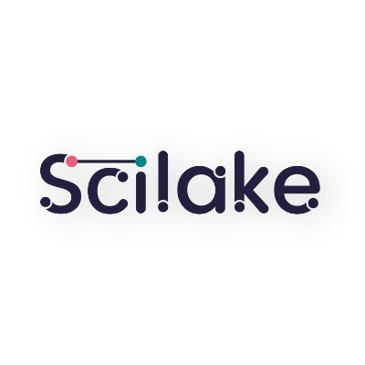

The NSLP workshop is financially co-supported by the [Scilake](https://scilake.eu/) project. 

SciLake tackles the fragmentation, diversity, and disorganisation of scientific knowledge, which hinders discovery and the extraction of valuable insights needed for informed decision-making in research. SciLake builds upon the OpenAIRE ecosystem and EOSC services to enable creation, interlinking, and maintenance of Science Knowledge Graphs (SKGs) and execution of data science and graph mining queries on top of them unlock the vast scientific knowledge space with advanced, AI-based services that exploit customised perspectives. SciLake is building a scientific data lake to store, interlink, and analyse both discipline-specific and cross-domain Science Knowledge Graphs, as well as raw, unstructured scholarly content. 
 
